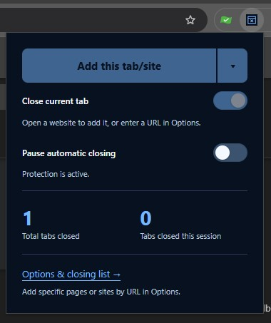

# TabBuster

**Your browser. Your tabs. Your call.**

TabBuster automatically closes annoying pages you've decided should stop appearing; permanently.
Add a page or an entire hostname to your list, and let it handle the repeat appearances.

Some overly helpful browser extension and software developers love to take liberties and load pages in your browser without your permission; update prompts, licensing reminders, pointless nags, etc., all become annoying.
One particularly useful video site enhancements extension, with a completely nagging and pointless page that intermittently pops up unbidden, was very inspirational in the creation of this simple, but effective extension. I decided I never wanted to see that page again.

## Quick & Easy

- **Alt+Shift+B** (Option+Shift+B on Mac) adds the active page using your current close-on-add preference. Change it or assign a whole-hostname shortcut in **Extensions → Keyboard shortcuts**. If the default is unavailable, choose another combination there.

- On the offending page, click the **TabBuster** icon, & **Add this tab/site** will add the current page for future actioning. Enabling **Close current tab** will add & close the tab.
- Set it to affect only that specific page, or the entire hostname
- **Pause automatic closing** anytime if you ever need to access the offending page.
- Review total and session closure counts, recent closures.
- Helpful toast tips inform you when a page has been busted. Enable the **In-browser notifications** in Settings and approve website access for brief page notices. System notifications remain available without that access and on protected pages.
- A detailed history of each busted tab is kept in the Settings.

## Installation

1. Choose **Code → Download ZIP** on GitHub, extract it, and keep the files in a permanent folder.
2. Open `chrome://extensions` in Chrome or `opera://extensions` in Opera/GX.
3. Enable **Developer mode**, choose **Load unpacked**, and select the inner **TabBuster** folder containing `manifest.json`.
4. Pin TabBuster to your toolbar for easy access.

To update, replace the files in the same folder and click **Reload** on the extension's card.

## Good to know

Chrome will need your permission for TabBuster to display in-browser notifications. This simply allows TabBuster to display the toast notification on whichever page you’re viewing. Nothing more.
Chrome’s protected pages—such as Settings and the Chrome Web Store—are exempted, so TabBuster will resort to using a system notification instead.

Matching pages will close even when you open them deliberately; pause before revisiting if you need to access them.
You may occasionally see a momentary flash when a tab appears & closes, but this is exceedingly rare.
TabBuster only ever closes tabs you add, it never affects other tabs, & offers no other security features.

Page rules ignore query strings and fragments. Subdomains, including `www`, need separate entries. The **? Help** button in Settings explains the details.

Rules, preferences, counts and recent closure history stay on your device. No analytics, remote code or background network requests. Removing the extension clears its saved data.

[A Digital☆Impulse Creation.](https://digital-impulse.com/) · [Buy me a coffee](https://ko-fi.com/digitalchet)

Embedded popups without an address bar can be added with the Add page shortcut. TabBuster saves a local SHA-256 fingerprint of the data address, not its contents. Only exact matches close; changed content or encoding needs adding again.
